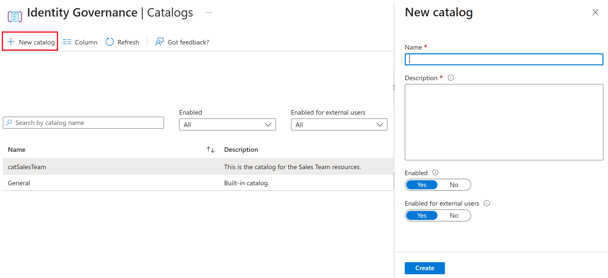

---
lab:
  title: 'Lab 1: Erstellen eines Katalogs zur Verwendung in Berechtigung'
  module: 'Module : Deploying access using Microsoft Entra entitlement management'
---

# Lab 1: Erstellen eines Katalogs in Microsoft Entra Entitlement Management

## Labszenario

In einem mittelständischen Softwareentwicklungsunternehmen entscheidet sich die IT-Abteilung, Microsoft Entra für die Berechtigungsverwaltung zu implementieren. Das Hauptziel besteht darin, den Zugriff auf Ressourcen und Anwendungen in der gesamten Organisation zu optimieren. Mit Microsoft Entra können sie Zugriffspakete basierend auf Rollen oder Projekten definieren, wodurch der Prozess der Gewährung oder Widerrufen von Zugriffsrechten vereinfacht wird. Wenn beispielsweise eine neue Fachkraft für Entwicklung zu einem Projekt hinzukommt, kann die IT-Abteilung ihm problemlos den erforderlichen Zugang gewähren, indem sie ihm das entsprechende Zugriffsspaket zuweist. Dies spart nicht nur Zeit, sondern verringert auch das Risiko eines nicht autorisierten Zugriffs. Darüber hinaus stellen die regelmäßigen Zugriffsüberprüfungen von Microsoft Entra sicher, dass nur die richtigen Personen Zugriff auf vertrauliche Ressourcen haben. Im Implementierungs-Lab wird das IT-Team verschiedene Zugriffspakete einrichten, Richtlinien für die automatische Zuweisung und die Sperrung von Zugriff definieren und eine virtuelle Zugriffsüberprüfung durchführen.

## Ziele

In diesem Lab lernen Sie Folgendes:

- Erstellen Sie einen Katalog.
- Konfigurieren eines Zugriffsspakets.
- Ein Zugriffspaket für einen Benutzenden bereitstellen.
- Akzeptieren Sie die Berechtigung als Benutzender, und bestätigen Sie den Ressourcenzugriff.
- Widerrufen des Zugriffs auf ein Paket.

## Lab-Einrichtung
  - **Geschätzte Dauer: 30 Minuten**

### Übung 1: Erstellen eines Katalogs für das Vertriebsteam

#### Aufgabe 1: Erstellen eines Katalogs

1. Starten Sie das Microsoft Entra Admin Center unter `https://Entra.Microsoft.com`.

1. Navigieren Sie im Menü auf der linken Seite zu **Identity Governance** und dann zu **Berechtigungsverwaltung**.

1. Wählen Sie **Kataloge** aus dem Menü.

 

1. Wählen Sie **+ Neuer Katalog** am oberen Rand des Bildschirms.

1. Benennen und beschreiben Sie Ihren **Neuen Katalog** mit den folgenden Werten:

  | Feld | Wert |
  | :---  | :---  |
  | Name  | `catSales` |
  | Beschreibung | `Use this catalog to assign resources for memebers of the Sales team.` |
  | Aktiviert | Ja |
  | Für externe Benutzer aktiviert | No |
  | | |

1. Klicken Sie auf **Erstellen**.

#### Aufgabe 2: Hinzufügen von Ressourcen zum Katalog

1. Wenn Sie noch nicht dort sind, navigieren Sie zum **Microsoft Entra Admin Center**, **Identity Governance**, **Berechtigungsverwaltung**, dann **Kataloge**.

1. Wählen Sie die **catSales**, die wir in der vorherigen Aufgabe erstellt haben.

1. Wählen Sie **Ressourcen** aus dem Menü.

1. Wählen Sie dann **+ Ressourcen hinzufügen** oben auf der Seite.

 

1. Fügen Sie mithilfe der Selektoren oben auf dem Bildschirm die folgenden Ressourcen hinzu:

  | Ressourcentyp | Wert |
  | :---  | :---  |
  | + Gruppen und Teams  | Vertrieb und Marketing, und Vertrieb in den USA |
  | + Anwendungen | LinkedIn |
  | + SharePoint-Seiten | Verkäufe und Marketing, und U.S.-Vertrieb |
  | | |

1. Wählen Sie die Schaltfläche **Hinzufügen** aus.

#### Aufgabe 3: Erstellen eines neuen Benutzenden zum Empfangen der Berechtigung

1. Wenn Sie nicht bereits dort sind, navigieren Sie zum **Microsoft Entra Admin Center**.

1. Wählen Sie aus dem Menü auf der linken Seite **Identität**, **Benutzende** und dann **Alle Benutzenden** aus den Menüs.

1. Wählen Sie **+ Neuer Benutzender** oben auf der Seite.

1. Füllen Sie die Werte auf der Seite **Grundlagen** aus:

  | Feld | Wert |
  | :---  | :---  |
  | Benutzerprinzipalname  | `ChrisGr` |
  | Diplay-Name | `Christopher Green` |
  | Automatisch generiertes Passwort | Eingecheckt |
  | Konto aktiviert? | Eingecheckt |
  | | |

1. Kopieren Sie das „Kennwort“ und fügen Sie es an einem sicheren Ort ein, z. B. in Notepad (Sie werden das Kennwort später in dieser Übung benötigen).

1. Wählen Sie die Registerkarte „Eigenschaften“.

1. Legen Sie unten auf dem Eigenschaften-Bildschirm den **Nutzungsort = USA** fest.

1. Wählen Sie **Überprüfen + Erstellen** und wählen Sie dann **Erstellen**.

#### Aufgabe 4: Generieren des Zugriffspakets

1. Wählen Sie im Microsoft Entra Admin Center **Identity Governance** und dann **Berechtigungsverwaltung** aus.

1. Wählen Sie im Menü Berechtigungsverwaltung **Zugriffspakete** aus.

1. Wählen Sie **+ Neues Zugriffspaket** oben auf dem Bildschirm.

1. Geben Sie die angeforderten Werte ein:

  | Feld | Wert |
  | :---  | :---  |
  | Name  | `pckSales` |
  | Diplay-Name | `Use this access package to assign resources to members of the Sales team.` |
  | Katalog | catSales |
  | | |

  **Anmerkung** - Sie müssen den Katalog catSales auswählen, den wir in der vorherigen Aufgabe erstellt haben. Hier finden Sie eine Liste der Ressourcen, die in diesem Paket zugewiesen werden können.  Es gibt ein allgemeines Paket, das als Standard aufgeführt ist.  Wenn Sie versehentlich diese Option gewählt haben, sind keine Ressourcen verfügbar.

1. Wählen Sie die Registerkarte „Ressourcenrollen“.

1. Wählen Sie aus dem catSales-Katalog die Ressourcen aus, die Sie im Zugriffspaket anbieten möchten. Verwenden Sie dann das Dropdown-Menü **Rolle wählen**, um die in der nachstehenden Tabelle aufgeführte Rolle festzulegen.

  | Ressourcentyp | Wert | Role |
  | :---  | :---  | :--- |
  | + Gruppen und Teams  | Vertrieb und Marketing | Member |
  | + Anwendungen | LinkedIn | msiam_access |
  | + SharePoint-Seiten | US-Vertrieb | US-Vertriebsmitglieder |
  | | |

1. Stellen Sie das Dropdown-Menü **Rolle wählen** so ein, dass die Rolle für jedes Element auf **Mitglied** gesetzt wird.

1. Verwenden Sie die **Nächste: Anforderungen>**, um zur Registerkarte Anforderungen zu gelangen.

1. Wählen Sie für die **Benutzenden, die Zugriff anfordern können** die Option **Keine (nur direkte Zuweisung durch Administrierende).

1. Setzen Sie **Aktivieren** auf **Ja**.

1. Wechseln Sie zur Registerkarte **Lebenszyklus**, indem Sie die Beschriftungen am oberen Rand des Bildschirms verwenden.

1. Wählen Sie die Werte, um den Lebenszyklus des Pakets festzulegen:

  | Feld | Wert |
  | :---  | :---  |
  | Zugriffspaket-Zuweisungen verfallen  | Anzahl von Tagen |
  | Zuweisungen verfallen nach | 30 |
  | Benutzende können eine bestimmte Zeitachse anfordern | No |
  | Zugriffsüberprüfung beantragen | No |
  | | |

1. Wählen Sie die Schaltfläche **Überprüfen + Erstellen** am unteren Rand des Bildschirms.

1. Überprüfen Sie die von Ihnen gewählten Werte auf dem Bildschirm Überprüfen + Erstellen.

1. Wählen Sie **Erstellen**, um Ihr Zugriffspaket zu erstellen.

#### Aufgabe 5: Zuweisen des Pakets zu Christopher

1. Stellen Sie sicher, dass Sie sich im **Microsoft Entra Admin Center**, **Identity Governance**, **Entitlement Management** befinden und das Menü **Zugriffspakete** geöffnet haben.

1. Wählen Sie die **pckSales** aus, die wir in der vorherigen Aufgabe erstellen.

1. Wählen Sie im Menü **Zuweisungen**.

1. Wählen Sie **+ Neue Zuweisung** oben auf dem Bildschirm.

1. Für die **Richtlinie auswählen** verwenden Sie die **Ursprüngliche Richtlinie**, die in der Dropdown-Liste angegeben ist.

1. Vergewissern Sie sich, dass **Benutzender bereits in meinem Verzeichnis** markiert ist.

1. Wählen Sie im Dialogfeld den Punkt **Benutzenden hinzufügen**.

1. Suchen Sie **Christopher Green** in der Liste der Benutzenden.  Setzen Sie einen Haken in das Kästchen neben dem Namen.  Wählen Sie dann die Schaltfläche **Auswählen** am unteren Rand des Bildschirms.

1. Belassen Sie die übrigen Werte auf den Standardwerten.

1. Wählen Sie unten auf der Seite die Schaltfläche **Hinzufügen** aus.

#### Aufgabe 6: Überprüfen Sie, ob Christopher Green hinzugefügt wurde.

1. Öffnen Sie ein **Neues InPrivate-Fenster** in Ihrem Browser.

1. Verbinden Sie sich mit **Microsoft Entra admin center** unter der Adresse `https://entra.microsoft.com`.

1. Loggen Sie sich mit Ihrem Chistopher Green-Konto und Ihrem Passwort ein.

1. Sie werden dann aufgefordert, Ihr Passwort zu ändern.  Legen Sie ein neues Kennwort fest, und notieren Sie es in einem Tool wie Editor für die zukünftige Verwendung.

1. Wählen Sie **Identität**, dann **Benutzender**, dann **Alle Benutzende**, und wählen Sie dann **Christopher Green**.

1. Wählen Sie aus dem Menü auf der linken Seite **Gruppen**.

1. Bestätigen Sie, dass Sie gemäß dem Zugriffspaket Zugriff auf die Gruppe **Vertrieb und Marketing** erhalten haben.

1. Wählen Sie im Menü auf der linken Seite **Anwendungen**.

1. Bestätigen Sie, dass Sie **LinkedIn** Ihre zugewiesenen Anwendungen sind.

#### Aufgabe 7: Herausforderung - Dynamische Änderungen am Access-Paket

  **Hinweis** : Diese Aufgabe enthält keine schrittweisen Anleitungen. Sie erhalten eine Reihe von Aufgaben, und Sie können auf die vorherigen Schritte verweisen, um sich daran zu erinnern, wo Sie bestimmte Änderungen vornehmen müssen.

- Stellen Sie sicher, dass Sie im **Microsoft Entra Admin Center** mit Ihrem Administratorkonto angemeldet sind.
- Öffnen Sie Ihr **pckSales**-Zugriffspaket.
- Gehen Sie zu den **Ressourcenrollen** und wählen Sie die Gruppe **Vertrieb und Marketing** aus und fügen Sie stattdessen die Gruppe **U.S. Vertrieb** hinzu.
- Verwenden Sie die Registerkarte **Zuweisungen**, um die Zuweisung **neu zu bearbeiten**.
- Loggen Sie sich aus und melden Sie sich erneut als Christopher Green an.  Beachten Sie, dass sich die Gruppenzuweisungen geändert haben.  So schnell und einfach.
- Widerrufen Sie den Zugriff, indem Sie die Zuweisung für Christopher Green löschen.

### Zusammenfassung
Dies ist ein einfaches Lab, um die grundlegenden Funktionen der Berechtigungsverwaltung zu demonstrieren.  Denken Sie an die Optionen, für die Sie diese Funktion nutzen könnten, und an die erweiterten Konfigurationsoptionen, die Sie im Lab konfigurieren könnten.
