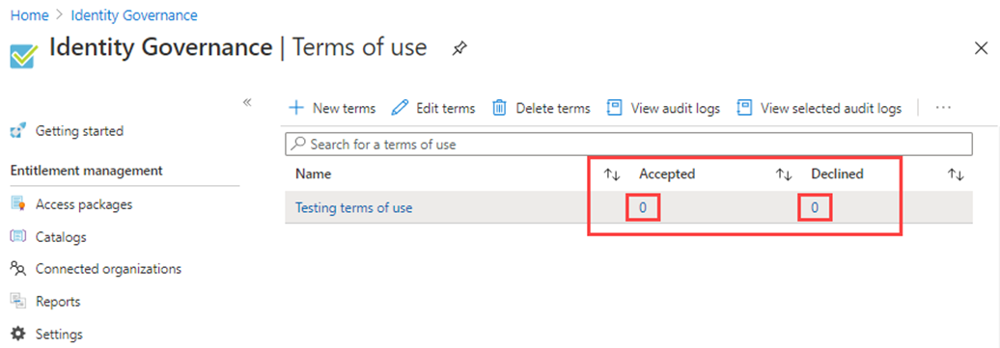
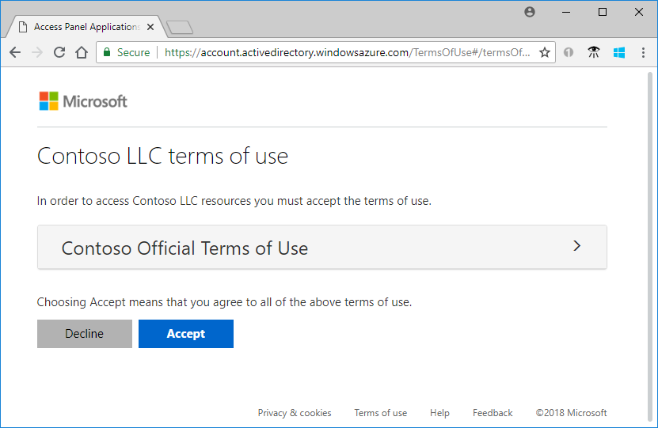
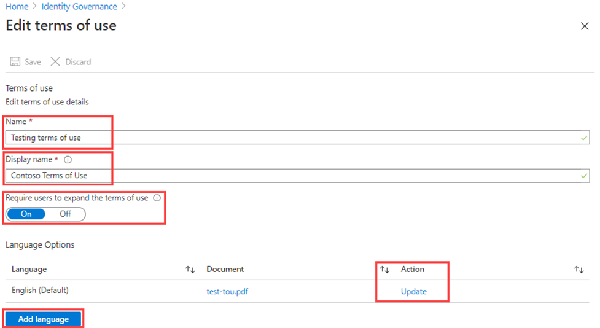

---
lab:
  title: 'Lab 3: - Nutzungsbedingungen und Akzeptanzberichte hinzufügen'
  module: 'Module : Deploying access using Microsoft Entra entitlement management'
---

# Lab 3: Nutzungsbedingungen und Akzeptanzberichte hinzufügen 

## Labszenario

Mit den Richtlinien der Microsoft Entra-Nutzungsbedingungen können Organisationen komfortabel Informationen für Endbenutzer anzeigen. Dadurch wird sichergestellt, dass Benutzern relevante Haftungsausschlüsse angezeigt werden, um rechtliche oder compliancebezogene Anforderungen zu erfüllen. Dieser Artikel enthält eine Einführung in die Verwendung von Richtlinien für Nutzungsbedingungen. Sie müssen eine ToU-Richtlinie für Ihre Organisation erstellen und durchsetzen.

#### Geschätzte Dauer: 20 Minuten

### Übung 1: Einrichten und Testen von Nutzungsbedingungen

#### Aufgabe 1: Hinzufügen von Nutzungsbedingungen

 **Wichtig** - Um die Nutzungsbedingungen von Microsoft Entra ID nutzen und konfigurieren zu können, müssen Sie Folgendes haben:
 - Microsoft Entra ID P1-, Premium P2-, EMS E3- oder EMS E5-Abonnement.
 - Wenn Sie keines dieser Abonnements haben, können Sie eine Testversion von Microsoft Entra ID Premium erhalten.
 - Eines der folgenden Administratorkonten für das Verzeichnis, das Sie konfigurieren möchten:
  - Globaler Administrator
  - Sicherheitsadministrator
  - Administrator für den bedingten Zugriff

1. Melden Sie sich mit einem globalen Administratorkonto bei [https://entra.microsoft.com](https://entra.microsoft.com) an.

2. Wählen Sie zum Öffnen **Identity Governance** im linken Navigationsmenü.

3. Wählen Sie im Menü unter **Berechtigungsverwaltung** die Option **Nutzungsbedingungen**.

4. Wählen Sie auf der Seite „Nutzungsbedingungen“ im oberen Menü die Option **+ Neue Bedingungen** aus.

    

5. Geben Sie im Feld **Name** die Bezeichnung **Testen von Nutzungsbedingungen** ein.

    **Hinweis**: Dies sind die Nutzungsbedingungen, die im Azure-Portal verwendet werden.

6. Wählen Sie das Feld **Dokument mit Nutzungsbedingungen** aus, navigieren Sie zu Ihrer PDF-Datei mit den fertig gestellten Nutzungsbedingungen, und wählen Sie die Datei aus.

   **ToU Datei bereitgestellt** – Browsen Sie zum Github-Repository **AllFiles/Labs/Lab3**, um ein Beispiel für ein PDF-Dokument mit Nutzungsbedingungen zu erhalten, das in diesem Lab verwendet werden kann.

7. Geben Sie im Feld **Anzeigename** die Bezeichnung **Contoso-Nutzungsbedingungen** ein.

    **Hinweis**: Dies ist der Titel, der den Benutzenden bei der Anmeldung angezeigt wird.

8. Wählen Sie **Englisch** als Sprache für Ihr Dokument mit Nutzungsbedingungen aus.

   **Hinweis**: Die Sprachoption ermöglicht das Hochladen mehrerer Nutzungsbedingungen in verschiedenen Sprachen. Die Version der Nutzungsbedingungen, die einem Endbenutzer angezeigt wird, basiert auf den Browsereinstellungen.

9. Legen Sie **Benutzer müssen die Nutzungsbedingungen erweitern** auf **Ein** fest, damit die Endbenutzer die Nutzungsbedingungen anzeigen müssen, bevor sie diesen zustimmen können.

10. Wenn die Endbenutzer Ihren Nutzungsbedingungen auf jedem Gerät zustimmen sollen, über das der Zugriff erfolgt, legen Sie **Zustimmung der Benutzer auf jedem Gerät erforderlich** auf **Aus** fest. Wenn diese Option aktiviert ist, müssen Benutzer möglicherweise weitere Anwendungen installieren.

    **Warnung**: Für die Zustimmung auf jedem Gerät müssen die Benutzenden jedes Gerät bei Microsoft Entra ID registrieren, bevor sie Zugriff erhalten. Es empfiehlt sich, diese Einstellung auf „Ein“ festzulegen. Für die Zwecke eines bereinigten Labs verwenden wir jedoch „Aus“.

11. Wenn die Zustimmungen zu Nutzungsbedingungen nach einem Zeitplan ablaufen sollen, legen Sie **Ablauf für Einwilligungen** auf **Ein** fest. Wenn diese Option aktiviert ist, werden zwei zusätzliche Zeitplaneinstellungen angezeigt.

12. Verwenden Sie die Einstellungen **Ablauf startet am** und **Häufigkeit**, um den Zeitplan für den Ablauf der Nutzungsbedingungen anzugeben. In der folgenden Tabelle wird das Ergebnis für ein paar Beispieleinstellungen aufgezeigt:

    | Ablauf startet am | Häufigkeit | Ergebnis |
    |---|---|---|
    | Heutiges Datum | Monatlich | Ab heute müssen die Benutzer den Nutzungsbedingungen zustimmen und diesen dann jeden Monat erneut zustimmen.|
    | Datum in der Zukunft | Monatlich | Ab heute müssen die Benutzer den Nutzungsbedingungen zustimmen. Wenn das Datum in der Zukunft eintritt, laufen die Zustimmungen ab, und die Benutzer müssen dann den Nutzungsbedingungen jeden Monat erneut zustimmen. |

    Wenn Sie beispielsweise das Datum für „Ablauf startet am“ auf **1. Jan.** und die Häufigkeit auf **Monatlich** festlegen, können sich für zwei Benutzer die folgenden Ablauftermine ergeben:

    | Benutzer | Erstes Zustimmungsdatum | Erstes Ablaufdatum | Zweites Ablaufdatum | Drittes Ablaufdatum |
    |---|---|---|---|---|
    | Alina | 1\. Januar | 1\. Februar | 1\. März | 1\. April|
    | Bernd | 15. Januar | 1\. Februar | 1\. März| 1\. April |

13. Verwenden Sie die Einstellung **Zeitraum bis erneute Zustimmung erforderlich ist (Tage)**, um die Anzahl von Tagen anzugeben, nach denen der Benutzer den Nutzungsbedingungen spätestens erneut zustimmen muss. Dies ermöglicht es den Benutzern, ihrem eigenen Zeitplan zu folgen. Wenn Sie beispielsweise den Zeitraum auf **30** Tage festlegen, können sich für zwei Benutzer die folgenden Ablauftermine ergeben:

    | Benutzer | Erstes Zustimmungsdatum | Erstes Ablaufdatum | Zweites Ablaufdatum | Drittes Ablaufdatum |
    |---|---|---|---|---|
    | Alina | 1\. Januar | 31. Januar | 2\. März | 1\. April|
    | Bernd | 15. Januar | 14. Februar | 16. März| 15. April

    **Hinweis**: Es ist möglich, die beiden Einstellungen „Ablauf für Einwilligungen“ und „Zeitraum bis erneute Zustimmung erforderlich ist (Tage)“ zusammen zu verwenden. In der Regel wird jedoch jeweils nur eine dieser Einstellungen verwendet.

14. Wählen Sie unter **Bedingter Zugriff** die Option **Benutzerdefinierte Richtlinie** aus.

    **WICHTIG**: Die Richtliniensteuerelemente für den bedingten Zugriff (einschließlich Nutzungsbedingungen) unterstützen die Erzwingung für Dienstkonten nicht. Es wird empfohlen, alle Dienstkonten von der Richtlinie für bedingten Zugriff auszuschließen.

    Benutzerdefinierte Richtlinien für bedingten Zugriff ermöglichen präzise Nutzungsbedingungen bis auf die Ebene einer spezifischen Cloudanwendung oder Benutzergruppe. Weitere Informationen finden Sie unter [https://docs.microsoft.com/en-us/azure/active-directory/conditional-access/require-tou](https://docs.microsoft.com/en-us/azure/active-directory/conditional-access/require-tou).

15. Wenn Sie fertig sind, wählen Sie **Erstellen** aus.

16. Sobald die Nutzungsbedingungen erstellt sind, werden Sie automatisch zur Seite „Richtlinie für bedingten Zugriff“ umgeleitet. Geben Sie auf der Seite im Feld **Name** die Bezeichnung **Nutzungsbedingungen erzwingen** ein.

17. Wählen Sie unter **Zuweisungen** die Option **0 Benutzende und Gruppen ausgewählt**.

18. Aktivieren Sie auf der Registerkarte „Einschließen“ das Kontrollkästchen **Benutzer und Gruppen**.

19. Wählen Sie im Bereich „Auswählen“ **Adele Vance** aus, das zum Testen der Nutzungsbedingungen verwenden werden soll.

   **Warnung**: Wenn Sie Ihr Administratorkonto auswählen, stellen Sie wie bei allen Richtlinien für bedingten Zugriff sicher, dass Sie über ein anderes Konto mit ausreichenden Berechtigungen zum Ändern der Richtlinie für bedingten Zugriff verfügen. Dadurch wird sichergestellt, dass Ihr Administratorkonto nicht gesperrt wird, wenn die Richtlinie für bedingten Zugriff zu einem unerwünschten Ergebnis führt.

20. Wählen Sie unter **Zielressourcen** die Option **Keine Zielressourcen ausgewählt**.

21. Wählen Sie **Alle Cloud-Apps** aus.

22. Unter **Zugriffskontrollen** und **Grant** wählen Sie **0 ausgewählte Kontrollen**.

23. Wählen Sie im Bereich „Gewähren“ die Option **Testen von Nutzungsbedingungen** und dann **Auswählen** aus.

24. Wählen Sie unter **Richtlinie aktivieren** die Option **An** aus.

25. Wenn Sie fertig sind, wählen Sie **Erstellen** aus.

    

26. Wenn Sie Ihr eigenes Konto verwenden möchten, können Sie den Browser aktualisieren. Sie werden zur erneuten Anmeldung aufgefordert. Bei der Anmeldung müssen Sie die Nutzungsbedingungen akzeptieren.

#### Aufgabe 2: Anmelden als Adele

1. Öffnen Sie ein neues InPrivate-Browserfenster.
2. Stellen Sie eine Verbindung mit https://portal.azure.com her.
3. Wenn das Portal mit der Meldung angezeigt wird, dass Sie bereits angemeldet sind, wählen Sie rechts oben auf dem Bildschirm den Namen des angemeldeten Benutzers aus, und wählen Sie **Mit einem anderen Konto anmelden** aus.
4. Melden Sie sich als Adele an:

    | Einstellung | Einzugebender Wert |
    | :--- | :--- |
    | Benutzername | **AdeleV@** `<<your domain name>>.onmicrosoft.com` |
    | Kennwort | Geben Sie das Administratorkennwort des Mandanten ein (Sie finden das Kennwort des Mandantenadministrators auf der Registerkarte „Labressourcen“). |

5. Überprüfen Sie die Anmeldung von Adele mit der MFA-Anforderung.
6. Zeigen Sie die Nutzungsbedingungen an.
7. Sie können **Annehmen** oder **Ablehnen** auswählen.

    **Hinweis**: Wenn Sie **Ablehnen** auswählen, müssen Sie bei einer zukünftigen Anmeldung als AdeleV erneut die Nutzungsbedingungen anzeigen und akzeptieren.

    **Hinweis**: Es kann einige Minuten dauern, bis die Nutzungsbedingungen angezeigt werden, oder Sie können sich beim Portal abmelden und wieder anmelden.
 
#### Aufgabe 3: Anzeigen des Berichts über akzeptierte und abgelehnte Nutzungsbedingungen

Auf der Seite für die Nutzungsbedingungen wird angezeigt, wie viele Benutzer die Bedingungen akzeptiert bzw. abgelehnt haben. Diese Werte sowie die Angabe, wer die Bedingungen akzeptiert/abgelehnt hat, werden für die Lebensdauer der Nutzungsbedingungen gespeichert.

1. Suchen Sie in Microsoft Azure unter **Identity Governance > Nutzungsbedingungen** Ihre Nutzungsbedingungen.

2. Wählen Sie neben dem Namen der Nutzungsbedingungen die Zahl unter **Akzeptiert** oder **Abgelehnt** aus, um den aktuellen Status für Benutzer anzuzeigen.

    

3. In dieser Übung sind möglicherweise keine akzeptierten oder abgelehnten Nutzungsbedingungen vorhanden. Im folgenden Beispiel wurde der Wert **Akzeptiert** ausgewählt. Es werden die gemeldeten Informationen zu den Benutzern angezeigt, die die Nutzungsbedingungen akzeptiert haben.

    

4. Wählen Sie auf der Seite **Zustimmungen zu Nutzungsbedingungen** die Option **Herunterladen** aus, um einen Zustimmungsbericht herunterzuladen.

5. Markieren Sie auf der Seite **Identity Governance | Nutzungsbedingungen** den Eintrag **Testen von Nutzungsbedingungen**, und wählen Sie **Ausgewählte Überwachungsprotokolle anzeigen** aus, um die Überwachungsprotokollaktivität anzuzeigen.

#### Aufgabe 4: Darstellung der Nutzungsbedingungen für Benutzer

1. Wenn Nutzungsbedingungen erstellt wurden und erzwungen werden, wird den betroffenen Benutzern die Seite mit den Nutzungsbedingungen angezeigt.

    

2. Benutzer können die Nutzungsbedingungen anzeigen und bei Bedarf die Schaltflächen zum Vergrößern und Verkleinern verwenden.

    

3. Auf mobilen Geräten werden die Nutzungsbedingungen ähnlich wie im folgenden Beispiel angezeigt.

    

#### Aufgabe 5: Möglichkeiten zum Lesen der Nutzungsbedingungen für Benutzer

Benutzer können die Nutzungsbedingungen, die sie akzeptiert haben, wie folgt lesen und anzeigen:

1. Navigieren Sie zu [https://myapps.microsoft.com](https://myapps.microsoft.com/), und melden Sie sich dann mit Ihrem Benutzerkonto an.

2. Wählen Sie das Benutzerprofilfoto und dann **Konto anzeigen** aus. Wählen Sie auf der Seite „Übersicht“ die Option EINSTELLUNGEN UND DATENSCHUTZ ANZEIGEN aus.

3. Wählen Sie auf der Seite „Einstellungen und Datenschutz“ die Registerkarte **Datenschutz** aus.

4. Unter **Hinweis der Organisation** können Sie die akzeptierten Nutzungsbedingungen überprüfen.

#### Aufgabe 6: Bearbeiten der Details der Nutzungsbedingungen

Sie können einige Details der Nutzungsbedingungen bearbeiten, aber kein vorhandenes Dokument ändern. Im Folgenden wird das Verfahren zum Bearbeiten von Details beschrieben.

1. Melden Sie sich bei [https://entra.microsoft.com](https://entra.microsoft.com) als globaler Administrator an.

2. Öffnen Sie Microsoft Entra ID und wählen Sie  **Identity Governance** aus dem Menü.

3. Wählen Sie im linken Navigationsmenü unter **Berechtigungsverwaltung** die Option **Nutzungsbedingungen** aus.

4. Wählen Sie die Nutzungsbedingungen aus, die Sie bearbeiten möchten.

5. Wählen Sie im oberen Menü die Option **Bedingungen bearbeiten** aus.

6. Sie können im Bereich „Nutzungsbedingungen bearbeiten“ Folgendes ändern:

 - **Name:** der interne Name der Nutzungsbedingungen, der nicht für Endbenutzer freigegeben wird
 - **Benutzer müssen die Nutzungsbedingungen erweitern:** Durch Festlegen dieser Option auf **Ein** erzwingen Sie, dass der Endbenutzer das Dokument mit den Nutzungsbedingungen erweitert muss, bevor er es akzeptieren kann.
 - **Vorhandenes Dokument mit Nutzungsbedingungen aktualisieren**.
 - Sie können eine Sprache zu vorhandenen Nutzungsbedingungen hinzufügen. Wenn Sie andere Einstellungen ändern möchten, beispielsweise die Optionen „Zustimmung der Benutzer auf jedem Gerät erforderlich“, „Ablauf für Einwilligungen“ und „Zeitraum bis erneute Zustimmung erforderlich ist (Tage)“ oder die Richtlinie für bedingten Zugriff, müssen Sie neue Nutzungsbedingungen erstellen.

    

7. Wenn Sie fertig sind, wählen Sie **Speichern** aus, um die Änderungen zu speichern.

#### Aufgabe 7: Aktualisieren eines vorhandenen Dokuments mit Nutzungsbedingungen

Es kann manchmal erforderlich sein, das Dokument mit den Nutzungsbedingungen zu aktualisieren.

1. Wählen Sie die Nutzungsbedingungen aus, die Sie bearbeiten möchten.

2. Wählen Sie **Bedingungen bearbeiten** aus.

3. Geben Sie in der Tabelle **Sprachoptionen** die Sprache der Nutzungsbedingungen an, die Sie aktualisieren möchten, und wählen Sie dann in der Spalte **Aktion** die Option **Aktualisieren** aus.

    

4. Im Bereich „Version der Nutzungsbedingungen aktualisieren“ können Sie eine neue Version Ihres Dokuments mit Nutzungsbedingungen hochladen.

5. Außerdem können Sie mithilfe der Umschaltfläche **Erneute Annahme erforderlich** erzwingen, dass Benutzer diese neue Version bei der nächsten Anmeldung akzeptieren müssen. Wenn die erneute Annahme durch die Benutzer nicht erzwungen wird, gilt die vorherige Einwilligung weiter. Die neue Version wird nur neuen Benutzern angezeigt, die noch nicht zugestimmt haben, oder Benutzern, deren Zustimmung abläuft.

    

6. Nachdem Sie die neue PDF-Datei hochgeladen und eine Entscheidung für die erneute Annahme getroffen haben, wählen Sie **Hinzufügen** aus.

7. Die neueste Version wird nun in der Spalte „Dokument“ angezeigt.
