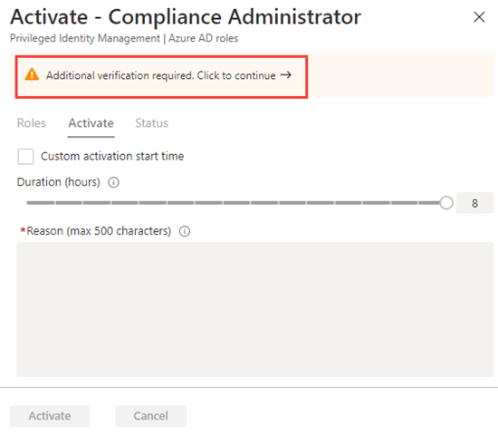

---
lab:
  title: 'Übung 5: - Privileged Identity Management für Microsoft Entra-Rollen konfigurieren'
  module: 'Module : Deploying access using Microsoft Entra entitlement management'
---

# Übung 5: Privileged Identity Management für Microsoft Entra-Rollen konfigurieren

## Labszenario

Administrierende für privilegierte Rollen können die privilegierte Identitätsverwaltung (Privileged Identity Management, PIM) in ihrer Microsoft Entra-Organisation anpassen, einschließlich der Änderung des Benutzererlebnisses für Benutzende, die eine autorisierte Rollenzuweisung aktivieren. Sie müssen sich mit der Konfiguration von PIM vertraut machen.

#### Geschätzte Dauer: 30 Minuten

### Übung 1: Konfigurieren der Microsoft Entra-Rolleneinstellungen

#### Aufgabe 1: Öffnen der Rolleneinstellungen

Befolgen Sie diese Schritte, um die Einstellungen für eine Microsoft Entra-Rolle zu öffnen.

1. Melden Sie sich bei [https://entra.microsoft.com](https://entra.microsoft.com) als globaler Administrator an.

2. Suchen und wählen Sie dann **Privileged Identity Management.**

3. Wählen Sie auf der Seite „Privileged Identity Management“ im linken Navigationsbereich **Microsoft Entra-Rollen**.

4. Wählen Sie auf der Seite „Schnellstart“ im linken Navigationsbereich **Einstellungen** aus.

    

5. Überprüfen Sie die Liste der Rollen, und geben Sie anschließend im Feld **Nach Rollenname suchen** den Begriff **Compliance** ein.

6. Wählen Sie in den Ergebnissen die Option **Complianceadministrator** aus.

7. Überprüfen Sie die Detailinformationen der Rolleneinstellungen.

#### Aufgabe 2: Anfordern der Genehmigung zur Aktivierung

1. Wählen Sie auf der Seite „Details zur Rolleneinstellung“ im oberen Menü **Bearbeiten** aus.

    

2. Aktivieren Sie auf der Seite „Rolleneinstellung bearbeiten – Complianceadministrator“ das Kontrollkästchen **Genehmigung zum Aktivieren anfordern**.

3. Wählen Sie **Genehmigende Personen auswählen** aus.

4. Wählen Sie im Bereich „Mitglied auswählen“ Ihr Administratorkonto aus, und wählen Sie **Auswählen** aus.

    

5. Wählen Sie nach der Konfiguration der Rolleneinstellungen **Aktualisieren** aus, um die Änderungen zu speichern.

### Übung 2: PIM mit Microsoft Entra-Rollen

#### Aufgabe 1: Zuweisen einer Rolle

Mit Microsoft Entra ID können globale Administrator*innen permanente Microsoft Entra Administratorrollenzuweisungen vornehmen. Diese Rollenzuweisungen können über das Microsoft Entra Admin Center, das Azure-Portal oder über PowerShell-Befehle erstellt werden. PIM ermöglicht es Administrierenden von privilegierten Rollen auch, permanente Admin-Rollenzuweisungen vorzunehmen. Außerdem können Administrator*innen für privilegierte Rollen Benutzer*innen als für Microsoft Entra-Administratorrollen berechtigt festlegen. Ein berechtigter Administrator kann die Rolle bei Bedarf aktivieren, und die entsprechenden Berechtigungen laufen nach einem bestimmten Zeitraum ab.

Führen Sie die folgenden Schritte aus, um Benutzende für eine Microsoft Entra Admin-Rolle zu qualifizieren.

1. Melden Sie sich bei [https://entra.microsoft.com](https://entra.microsoft.com) mit einem globalen Administratorkonto an.

2. Suchen und wählen Sie dann **Privileged Identity Management.**

    **Hinweis**: Sie finden es im Menü unter Identity – Identity Governance – Privileged Identity Management

3. Wählen Sie auf der Seite „Privileged Identity Management“ im linken Navigationsbereich **Microsoft Entra-Rollen**.

4. Wählen Sie auf der Seite „Schnellstart“ im linken Navigationsbereich **Rollen** aus.

5. Wählen Sie im oberen Menü **+ Zuweisungen hinzufügen** aus.

    

6. Überprüfen Sie die Einstellungen auf der Seite „Zuweisungen hinzufügen“ auf der Registerkarte **Mitgliedschaft**.

7. Wählen Sie das Menü **Rolle auswählen** aus, und wählen Sie dann **Complianceadministrator** aus.

8. Mithilfe des Felds **Nach Rollenname suchen** können Sie nach einer Rolle suchen.

9. Wählen Sie unter **Mitglied(er) auswählen** die Option **Keine Mitglieder ausgewählt** aus.

10. Wählen Sie im Bereich „Mitglied auswählen“ **Miriam Graham** und dann **Auswählen** aus.

11. Wählen Sie auf der Seite Zuweisungen hinzufügen die Option **Weiter >**.

12. Überprüfen Sie auf der Registerkarte **Einstellungen** unter **Zuweisungstyp** die verfügbaren Optionen. Verwenden Sie für diese Aufgabe die Standardeinstellung **Wählbar**.

    - Für berechtigte Zuweisungen muss das Mitglied der Rolle eine Aktion durchführen, um die Rolle verwenden zu können. Beispiele für Aktionen sind eine erfolgreiche Überprüfung der Multi-Faktor-Authentifizierung (MFA), die Angabe einer geschäftlichen Begründung oder das Anfordern einer Genehmigung von den angegebenen genehmigenden Personen.
    - Für aktive Zuweisungen ist es nicht erforderlich, dass das Mitglied eine Aktion durchführt, um die Rolle nutzen zu können. Bei als aktiv zugewiesenen Mitgliedern sind die Berechtigungen immer der Rolle zugewiesen.

13. Überprüfen Sie die restlichen Einstellungen, und wählen Sie dann **Zuweisen** aus.

#### Aufgabe 2: Anmelden als Miriam

1. Öffnen Sie ein neues InPrivate-Browserfenster.
2. Verbinden Sie sich mit dem Microsoft Entra Admin Center (https://entra.microsoft.com)).
    **Hinweis**: Wenn sich die Seite mit einem angemeldeten Benutzenden öffnet, klicken Sie auf dessen Namen in der oberen rechten Ecke und wählen Sie **Mit einem anderen Konto anmelden**.
3. Melden Sie sich als Miriam an.

   | Feld | Wert |
   | :--- | :--- |
   | Benutzername | **MiriamG@** `<<your domain.onmicrosoft.com>>` |
   | Kennwort |  Geben Sie das Administratorkennwort des Mandanten ein (Sie finden das Kennwort des Mandantenadministrators auf der Registerkarte „Labressourcen“). |

**HINWEIS** - wenn Sie dazu aufgefordert werden, ändern Sie Ihr Passwort.

5. Öffnen Sie im Menü **Identität** **Benutzer** und wählen Sie dann **Alle Benutzer**.
6. Finden Sie **Miriam** in der Liste der Benutzenden.
7. Suchen Sie auf der Seite **Übersicht** nach den **Zugewiesenen Rollen**.
8. Wählen Sie **Zulässige Zuweisungen**.
1. Beachten Sie, dass die Rolle **Complianceadministrator** jetzt für Miriam verfügbar ist.

#### Aufgabe 3: Aktivieren Ihrer Microsoft Entra-Rollen

Wenn Sie eine Microsoft Entra-Rolle übernehmen müssen, können Sie die Aktivierung anfordern, indem Sie **Meine Rollen** in „Privileged Identity Management öffnen“.

1. Suchen Sie in der Leiste **Ressourcen, Dienste und Dokumente durchsuchen** nach „Privileged“.
2. Öffnen Sie die Seite **Privileged Identity Management**.
3. Wählen Sie auf der Seite „Privileged Identity Management“ im linken Navigationsmenü **Meine Rollen** aus.

4. Überprüfen Sie auf der Seite „Meine Rollen“ die Liste der **wählbaren Zuweisungen**.

    

5. Wählen Sie in der Zeile der Rolle „Complianceadministrator“ die Option **Aktivieren** aus.

6. Wählen Sie im Bereich „Aktivieren – Complianceadministrator“ die Option **Zusätzliche Überprüfung erforderlich** aus, und führen Sie dann die Schritte zur Bereitstellung einer zusätzlichen Sicherheitsüberprüfung aus. Sie müssen sich nur einmal pro Sitzung authentifizieren.

    

    **Überprüfung**: Basierend auf unserer aktuellen Konfiguration der Labumgebung müssen Sie MFA konfigurieren und sich erfolgreich anmelden.

7. Geben Sie nach Abschluss der zusätzlichen Sicherheitsüberprüfung im Bereich „Aktivieren – Complianceadministrator“ im Feld **Grund** den Text **Das ist meine Begründung für die Aktivierung dieser Rolle** ein.

    **Wichtiger Hinweis**: Gehen Sie nach dem Prinzip der geringsten Rechte vor: Sie sollten das Konto nur so lange aktivieren, wie Sie es benötigen.  Wenn die erforderlich Arbeit nur 1,5 Stunden dauert, dann legen Sie die Dauer auf zwei Stunden fest.  Wenn Sie wissen, dass Sie die Arbeit erst nach 15:00 Uhr ausführen können, wählen Sie eine benutzerdefinierte Aktivierungszeit aus.

8. Wählen Sie **Aktivieren** aus.

#### Aufgabe 4: Zuweisen einer Rolle mit eingeschränktem Bereich

Bei bestimmten Rollen kann der Bereich der erteilten Berechtigungen auf eine einzelne Verwaltungseinheit, einen Dienstprinzipal oder eine Anwendung beschränkt werden. Dieses Verfahren ist ein Beispiel für die Zuweisung einer Rolle, die den Bereich einer Verwaltungseinheit aufweist.

1. Vergessen Sie nicht, die Browserfenster für MiriamG zu schließen, und öffnen Sie dann das Microsoft Entra Admin Center mit Ihrem Administratorkonto.
2. Rufen Sie die Seite „Privileged Identity Management“ auf, und wählen Sie im linken Navigationsmenü Azure **Microsoft Entra-Rollen.**
3. Wählen Sie **Rollen** aus.
4. Wählen Sie auf der Seite „Rollen“ im oberen Menü **+ Zuweisungen hinzufügen** aus.

5. Wählen Sie auf der Seite „Zuweisungen hinzufügen“ unter **Rolle auswählen** die Option **Benutzeradministrator** aus.

6. Wählen Sie das Menü **Bereichstyp** aus, und überprüfen Sie die verfügbaren Optionen. Wählen Sie für die Übung den Bereichstyp **Verzeichnis** aus.

   **Tipp**: Weitere Informationen zum Bereichstyp „Administrative Einheit“ finden Sie unter [https://docs.microsoft.com/en-us/azure/active-directory/roles/admin-units-manage](https://docs.microsoft.com/en-us/azure/active-directory/roles/admin-units-manage).

7. Hier können Sie später, wie schon beim Zuweisen einer Rolle ohne Bereichseinschränkung, Mitglieder hinzufügen und die Einstellungsoptionen abschließen. Wählen Sie für den Moment jedoch **Abbrechen** aus.

#### Aufgabe 5: Aktualisieren oder Entfernen einer vorhandenen Rollenzuweisung

Befolgen Sie diese Anweisungen zum Aktualisieren oder Entfernen einer vorhandenen Rollenzuweisung.

1. Wählen Sie auf der Seite „Privileged Identity Management“ > „Microsoft Entra-Rollen öffnen“ in der linken Navigation **Zuweisungen**.

2. Überprüfen Sie in der Liste **Zuweisungen** unter „Complianceadministrator“ die Optionen in der Spalte **Aktion**.

3. Wählen Sie **Aktualisieren** aus, und überprüfen Sie die im Bereich „Mitgliedschaftseinstellungen“ verfügbaren Optionen. Wenn Sie fertig sind, schließen Sie den Bereich.

4. Wählen Sie **Entfernen**.

5. Überprüfen Sie im Dialogfeld **Entfernen** die Informationen, und wählen Sie **Ja** aus.
